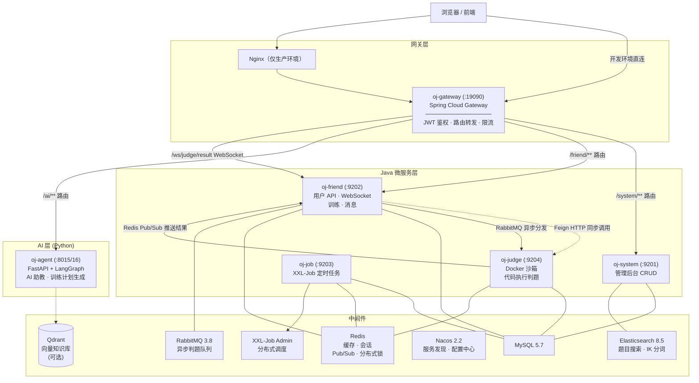
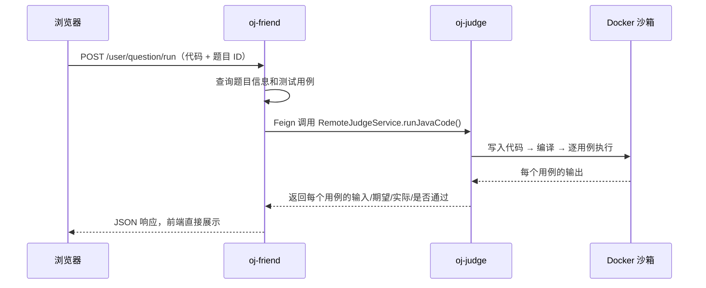
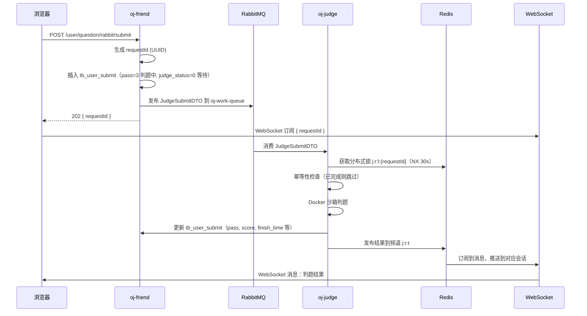
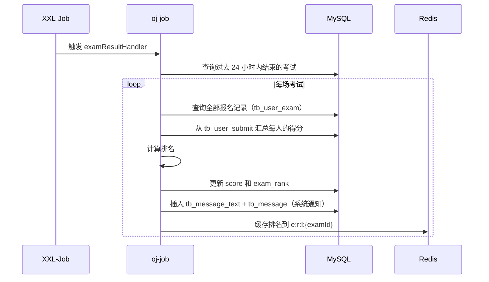
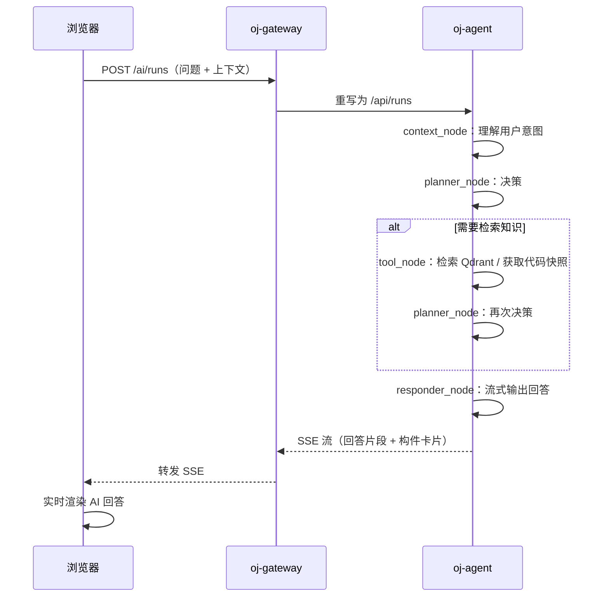
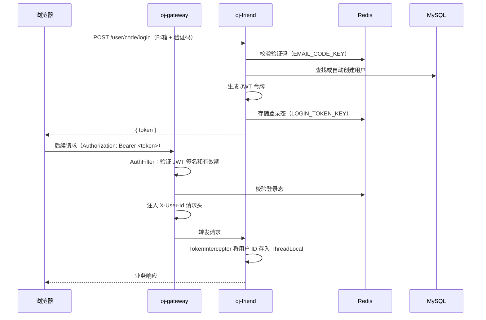

# SynCode 技术架构文档

> **SynCode** 是一个模块化的在线编程判题（Online Judge）与 AI 辅助训练平台。
>
> 本文档从架构总览、数据库设计、微服务职责、中间件拓扑、核心业务链路五个维度介绍项目全貌。

---

## 目录

- [1. 项目概览](#1-项目概览)
- [2. 系统架构](#2-系统架构)
- [3. 技术栈](#3-技术栈)
- [4. 数据库设计](#4-数据库设计)
- [5. 后端微服务](#5-后端微服务)
- [6. 前端架构](#6-前端架构)
- [7. AI 智能体 (oj-agent)](#7-ai-智能体-oj-agent)
- [8. 中间件](#8-中间件)
- [9. 核心业务链路](#9-核心业务链路)
- [附录：关键文件索引](#附录关键文件索引)

---

## 1. 项目概览

SynCode 是一个面向编程测评与 AI 辅助训练的全栈平台，围绕以下核心能力展开：

- **题目管理** — 管理员创建/管理编程题目
- **在线判题** — 用户提交代码，后端通过 Docker 安全沙箱运行并判定结果
- **竞赛考试** — 按场次组织题目，支持排名计算和结果通知
- **AI 助教** — LangGraph 驱动的工作区 AI，提供个性化答疑和知识检索
- **训练计划** — AI 根据用户水平生成刷题计划，追踪学习进度

### 目录结构

```
bite-oj-master/
│
├── oj-gateway/                    # API 网关 (Spring Cloud Gateway)
├── oj-common/                     # 通用基础库 (8 个子模块)
│   ├── oj-common-core/            #   基础实体、常量、工具类
│   ├── oj-common-security/        #   鉴权拦截器
│   ├── oj-common-redis/           #   Redis 操作封装
│   ├── oj-common-rabbitmq/        #   RabbitMQ 配置
│   ├── oj-common-mybatis/         #   MyBatis-Plus 自动填充
│   ├── oj-common-swagger/         #   SpringDoc OpenAPI
│   ├── oj-common-file/            #   阿里云 OSS
│   └── oj-common-message/         #   邮件 / 短信发送
│
├── oj-api/                        # Feign 接口 + 共享 DTO
├── oj-modules/                    # 微服务实现
│   ├── oj-system/                 #   管理后台 (:9201)
│   ├── oj-friend/                 #   用户服务 (:9202)
│   ├── oj-judge/                  #   判题沙箱 (:9204)
│   └── oj-job/                    #   定时任务 (:9203, XXL-Job)
│
├── oj-agent/                      # Python AI 助教 (FastAPI + LangGraph)
├── frontend/                      # Next.js 前端 (monorepo, 3 apps + 4 packages)
│
├── deploy/                        # 部署资产
│   ├── dev/                       #   本地开发: docker-compose + SQL + 启动脚本
│   ├── prod/                      #   生产部署: Dockerfile + Swarm + Nginx + 部署脚本
│   ├── runner/                    #   GitHub 自托管 Runner 镜像
│   └── test/                      #   测试环境 (历史静态保留)
│
├── docker-compose-infra.yml       # 本地基础设施 (MySQL/Redis/RabbitMQ/ES)
├── pom.xml                        # Maven 根 POM
└── README.md
```

---

## 2. 系统架构

### 整体拓扑



### 服务间通信方式

| 通信模式 | 实现机制 | 用途举例 |
|---|---|---|
| **同步 RPC** | Feign (HTTP) | oj-friend → oj-judge：同步运行代码 |
| **异步消息** | RabbitMQ | oj-friend → oj-judge：异步判题分发 |
| **实时推送** | WebSocket + Redis Pub/Sub | oj-judge → Redis → oj-friend → 浏览器 |
| **服务发现** | Nacos | 所有服务注册到 Nacos，相互发现 |
| **配置管理** | Nacos Config / 本地 YAML | 本地开发跳过 Nacos，生产环境开启 |
| **网关路由** | Spring Cloud Gateway | 所有外部流量经 oj-gateway 进入 |

---

## 3. 技术栈

### 后端 (Java)

| 技术 | 版本 | 用途 |
|---|---|---|
| Java | 17 | 运行环境 |
| Spring Boot | 3.2.5 | 应用框架 |
| Spring Cloud | 2023.0.1 | 微服务生态 |
| Spring Cloud Alibaba | 2023.0.1.2 | Nacos 集成 |
| Spring Cloud Gateway | - | API 网关 |
| MyBatis-Plus | 3.5.5 | ORM 框架 |
| MySQL | 5.7+ | 持久化数据库 |
| Redis | - | 缓存、会话、Pub/Sub、分布式锁 |
| RabbitMQ | 3.8.30 | 异步任务队列 + 死信重试 |
| Elasticsearch | 8.5.3 | 题目全文搜索（IK 分词器） |
| Nacos | 2.2.2 | 服务发现 + 配置中心 |
| XXL-Job | 2.4.0 | 分布式定时任务 |
| docker-java | 3.3.4 | Docker 沙箱管理 |
| 阿里云 OSS | 3.17.4 | 文件存储 |
| SpringDoc OpenAPI | 2.2.0 | API 文档 (Swagger UI) |
| Hutool | 5.8.22 | Java 工具库 |
| FastJSON | 2.0.43 | JSON 序列化 |
| JWT (jjwt) | 0.9.1 | 令牌认证 |
| Lombok | 1.18.38 | 代码简化 |

### AI 智能体 (Python)

| 技术 | 版本 | 用途 |
|---|---|---|
| Python | ≥ 3.11 | 运行环境 |
| FastAPI | ≥ 0.115 | HTTP 服务器 (ASGI) |
| LangGraph | ≥ 1.0 | AI 工作流状态机 |
| LangChain Core | ≥ 1.2 | LLM 抽象层 |
| langchain-openai | ≥ 1.1 | DeepSeek 调用（兼容 OpenAI 协议） |
| Qdrant Client | ≥ 1.10 | 向量数据库客户端 |

### 前端

| 技术 | 版本 | 用途 |
|---|---|---|
| Node.js | 22 | 运行环境 |
| Next.js | 15.3 | React 框架 (App Router) |
| React | 19 | UI 库 |
| TypeScript | 5.8 | 语言 |
| Tailwind CSS | 4.1 | 样式 |
| Monaco Editor | - | 代码编辑器 |
| Lucide React | - | 图标库 |

---

## 4. 数据库设计

### 实体关系图 (ER)

```mermaid
erDiagram
    tb_sys_user {
        bigint user_id PK         "管理员 ID"
        varchar user_account UK   "登录账号"
        char password             "bcrypt 哈希密码"
    }

    tb_question {
        bigint question_id PK     "题目 ID"
        varchar title             "题目标题"
        tinyint difficulty        "1=简单 2=中等 3=困难"
        int time_limit            "时间限制(ms)"
        int space_limit           "空间限制(KB)"
        varchar content           "题目描述"
        varchar question_case     "JSON 测试用例"
        varchar default_code      "默认代码模板"
    }

    tb_exam {
        bigint exam_id PK         "考试 ID"
        varchar title             "考试标题"
        datetime start_time       "开始时间"
        datetime end_time         "结束时间"
        tinyint status            "0=草稿 1=已发布"
    }

    tb_exam_question {
        bigint exam_question_id PK "关系 ID"
        bigint question_id FK     "题目 ID"
        bigint exam_id FK         "考试 ID"
        int question_order        "题目顺序"
    }

    tb_user {
        bigint user_id PK         "用户 ID"
        varchar email             "登录邮箱"
        char code                 "验证码"
        varchar nick_name         "昵称"
        tinyint status            "0=封禁 1=正常"
    }

    tb_user_exam {
        bigint user_exam_id PK    "关系 ID"
        bigint user_id FK         "用户 ID"
        bigint exam_id FK         "考试 ID"
        int score                 "得分"
        int exam_rank             "排名"
    }

    tb_user_submit {
        bigint submit_id PK       "提交 ID"
        varchar request_id UK     "异步判题请求 UUID"
        bigint user_id FK         "用户 ID"
        bigint question_id FK     "题目 ID"
        bigint exam_id FK         "考试 ID（可为空）"
        text user_code            "用户代码"
        tinyint pass              "0=未通过 1=通过 2=未提交 3=判题中"
        tinyint judge_status      "0=等待 1=成功 2=死信"
        int retry_count           "重试次数"
        datetime finish_time      "完成时间"
    }

    tb_message_text {
        bigint text_id PK         "消息内容 ID"
        varchar message_title     "消息标题"
        varchar message_content   "消息内容"
    }

    tb_message {
        bigint message_id PK      "消息 ID"
        bigint text_id FK         "消息内容 ID"
        bigint send_id            "发送者 ID"
        bigint rec_id             "接收者 ID"
    }

    tb_notice {
        bigint notice_id PK       "公告 ID"
        varchar title             "标题"
        text content              "正文"
        varchar category          "分类"
        tinyint is_public         "是否公开"
        tinyint is_pinned         "是否置顶"
        tinyint status            "0=草稿 1=已发布"
        datetime publish_time     "发布时间"
    }

    tb_training_profile {
        bigint profile_id PK      "档案 ID"
        bigint user_id FK, UK     "用户 ID（唯一）"
        varchar current_level     "当前等级"
        varchar target_direction  "目标方向"
        text weak_points          "薄弱点"
        text strong_points        "优势点"
    }

    tb_training_plan {
        bigint plan_id PK         "计划 ID"
        bigint user_id FK         "用户 ID"
        varchar plan_title        "计划标题"
        varchar source_type       "来源类型"
        tinyint plan_status       "0=待开始 1=进行中 2=已完成 3=已过期"
        text ai_summary           "AI 摘要"
    }

    tb_training_task {
        bigint task_id PK         "任务 ID"
        bigint plan_id FK         "计划 ID"
        bigint user_id FK         "用户 ID"
        varchar task_type         "question / exam / review"
        bigint question_id FK     "题目 ID（可为空）"
        bigint exam_id FK         "考试 ID（可为空）"
        tinyint task_status       "0=待完成 1=已完成 2=已跳过"
        datetime due_time         "截止时间"
    }

    tb_question ||--o{ tb_exam_question : "出现在"
    tb_exam ||--o{ tb_exam_question : "包含"
    tb_exam ||--o{ tb_user_exam : "报名"
    tb_user ||--o{ tb_user_exam : "参加"
    tb_user ||--o{ tb_user_submit : "提交"
    tb_question ||--o{ tb_user_submit : "被提交"
    tb_message_text ||--o{ tb_message : "投递为"
    tb_user ||--o{ tb_message : "接收"
    tb_user ||--o{ tb_training_plan : "拥有"
    tb_user ||--|| tb_training_profile : "拥有"
    tb_training_plan ||--o{ tb_training_task : "包含"
```



---

### 表结构详解

#### 通用字段（所有表均包含）

以下 4 个审计字段由 MyBatis-Plus 的 `MyMetaObjectHandler` 自动填充：

| 字段 | 类型 | 说明 |
|---|---|---|
| create_by | bigint unsigned | 创建人 ID |
| create_time | datetime | 创建时间 |
| update_by | bigint unsigned | 更新人 ID |
| update_time | datetime | 更新时间 |

---

#### tb_sys_user — 管理员账号

存放后台管理系统的登录账号。

| 字段 | 类型 | 约束 | 说明 |
|---|---|---|---|
| user_id | bigint unsigned | 主键 | 管理员 ID（雪花算法生成） |
| user_account | varchar(20) | 唯一非空 | 登录账号 |
| nick_name | varchar(20) | | 显示名称 |
| password | char(60) | 非空 | bcrypt 哈希密码 |

---

#### tb_question — 题库

存放编程题目的核心表。每道题包含描述、测试用例、默认代码模板。

| 字段 | 类型 | 说明 |
|---|---|---|
| question_id | bigint unsigned PK | 题目 ID |
| title | varchar(50) | 题目标题 |
| difficulty | tinyint | `1`=简单, `2`=中等, `3`=困难 |
| algorithm_tag | varchar(100) | 主要算法标签（如 `binary_search`） |
| knowledge_tags | varchar(500) | 逗号分隔的知识点标签（如 `"array,hash,simulation"`） |
| estimated_minutes | int | 预估解题时间（分钟），供训练计划参考 |
| training_enabled | tinyint(1) | 是否允许出现在 AI 训练计划中 |
| time_limit | int | 时间限制（毫秒） |
| space_limit | int | 内存限制（KB） |
| content | varchar(1000) | 题目描述文本 |
| question_case | varchar(1000) | JSON 测试用例数组：`[{"input":"...","output":"..."}]` |
| default_code | varchar(2000) | 默认代码模板，用户在编辑器中看到的内容 |
| main_fuc | varchar(500) | 入口方法签名 |

> 该表同时被 Elasticsearch 索引，支持全文搜索。

---

#### tb_exam — 考试

考试/竞赛的头部信息。

| 字段 | 类型 | 说明 |
|---|---|---|
| exam_id | bigint unsigned PK | 考试 ID |
| title | varchar(50) | 考试标题 |
| start_time | datetime | 考试开始时间 |
| end_time | datetime | 考试结束时间 |
| status | tinyint | `0`=草稿, `1`=已发布 |

---

#### tb_exam_question — 考试题目关联

多对多关联表，同时记录题目在考试中的顺序。

| 字段 | 类型 | 说明 |
|---|---|---|
| exam_question_id | bigint unsigned PK | 关联 ID |
| question_id | bigint unsigned | 外键 → tb_question |
| exam_id | bigint unsigned | 外键 → tb_exam |
| question_order | int | 题目顺序，从 1 开始递增 |

---

#### tb_user — 前端用户

存放使用平台的学员信息。采用邮箱验证码登录。

| 字段 | 类型 | 约束 | 说明 |
|---|---|---|---|
| user_id | bigint unsigned | 主键 | 用户 ID |
| nick_name | varchar(20) | | 昵称 |
| head_image | varchar(200) | | 头像 URL |
| sex | tinyint | | `1`=男, `2`=女 |
| phone | varchar(20) | | 手机号（可为空） |
| code | char(6) | | 邮箱验证码 |
| email | varchar(100) | | 登录邮箱 |
| wechat | varchar(20) | | 微信号 |
| school_name | varchar(50) | | 学校 |
| major_name | varchar(50) | | 专业 |
| introduce | varchar(255) | | 个人介绍 |
| status | tinyint | 非空 | `0`=封禁, `1`=正常 |

---

#### tb_user_exam — 用户考试报名

记录用户报名了哪些考试以及得分排名。

| 字段 | 类型 | 说明 |
|---|---|---|
| user_exam_id | bigint unsigned PK | 关联 ID |
| user_id | bigint unsigned | 外键 → tb_user |
| exam_id | bigint unsigned | 外键 → tb_exam |
| score | int unsigned | 最终得分（考试结束后由 XXL-Job 计算） |
| exam_rank | int unsigned | 排名（考试结束后由 XXL-Job 计算） |

---

#### tb_user_submit — 用户提交记录（核心表）

该表是判题系统的核心，记录每次代码提交的完整生命周期。

| 字段 | 类型 | 说明 |
|---|---|---|
| submit_id | bigint unsigned PK | 提交记录 ID |
| request_id | varchar(64) UNIQUE | 异步判题请求 UUID，用于跟踪整个判题链路 |
| user_id | bigint unsigned | 外键 → tb_user |
| question_id | bigint unsigned | 外键 → tb_question |
| exam_id | bigint unsigned | 外键 → tb_exam（为空表示练习模式） |
| program_type | tinyint | `0`=Java, `1`=CPP |
| user_code | text | 用户提交的源代码 |
| pass | tinyint | `0`=未通过, `1`=通过, `2`=未提交, `3`=判题中 |
| exe_message | varchar(500) | 执行结果描述（如 Accepted / Wrong Answer） |
| score | int | 得分（满分 100） |
| case_judge_res | text | 每个测试用例的判题结果（JSON 格式） |
| use_time | bigint | 运行耗时（毫秒） |
| use_memory | bigint | 运行内存（KB） |
| judge_status | tinyint | `0`=等待中, `1`=判题成功, `2`=死信, `3`=投递失败 |
| retry_count | int | RabbitMQ 重试次数快照 |
| last_error | varchar(1000) | 最后一次错误摘要 |
| finish_time | datetime | 判题完成时间 |

**索引：** `idx_user_question_exam_create` 联合索引 `(user_id, question_id, exam_id, create_time)`。

**生命周期：**
1. 用户提交 → 以 `pass=3`（判题中），`judge_status=0`（等待中）插入
2. JudgeService 处理 → 更新 `pass` + `score` + `exe_message`
3. 成功：`judge_status=1`, `finish_time=NOW()`
4. 失败（RabbitMQ）：最多重试 3 次，之后进入死信队列

---

#### tb_message_text + tb_message — 站内信

双表设计避免消息体重复存储：

```
tb_message_text（一条记录 = 一份内容）
       │
       └── tb_message（每条记录 = 一个收件人的一条消息）
```

**tb_message_text** 存放消息内容：

| 字段 | 类型 | 说明 |
|---|---|---|
| text_id | bigint unsigned PK | 消息内容 ID |
| message_title | varchar(50) | 消息标题 |
| message_content | varchar(500) | 消息正文 |

**tb_message** 存放发送关系：

| 字段 | 类型 | 说明 |
|---|---|---|
| message_id | bigint unsigned PK | 消息 ID |
| text_id | bigint unsigned | 外键 → tb_message_text |
| send_id | bigint unsigned | 发送者用户 ID |
| rec_id | bigint unsigned | 接收者用户 ID |

---

#### tb_notice — 系统公告

支持发布/撤回、置顶/取消、公开/私有的多维度控制。

| 字段 | 类型 | 说明 |
|---|---|---|
| notice_id | bigint unsigned PK | 公告 ID |
| title | varchar(100) | 公告标题 |
| content | text | 公告正文 |
| category | varchar(32) | 分类，如 `Announcement` / `Contest` / `Feature` |
| is_public | tinyint(1) | `0`=私有, `1`=公开 |
| is_pinned | tinyint(1) | `0`=普通, `1`=置顶 |
| status | tinyint | `0`=草稿, `1`=已发布 |
| publish_time | datetime | 发布时间 |

**索引：** `idx_notice_public_publish` (is_public, status, publish_time) 和 `idx_notice_pinned_publish` (is_pinned, publish_time) 优化公告列表查询。

---

#### 训练相关表（tb_training_profile / tb_training_plan / tb_training_task）

三张表构成 AI 训练子系统：

**tb_training_profile** — 每个用户一份，记录 AI 评估的技能水平、薄弱点和优势点。

**tb_training_plan** — 训练计划头，状态流转：`待开始 → 进行中 → 已完成/已过期`。

**tb_training_task** — 计划下的具体任务。`task_type` 可以是：
- `question` — 做一道题
- `exam` — 参加一场考试
- `review` — 复习回顾

任务状态：`0=待完成 → 1=已完成 / 2=已跳过`。

---

### 数据库初始化

数据库初始化脚本位于：

```
deploy/dev/sql/init-db.sql
```

该文件将原有的 8 个增量迁移 SQL 合并为一个完整的初始化脚本。执行时会：

1. 创建 `bitoj_dev` 数据库（如不存在）
2. 删除所有 13 张表（清空重置）
3. 以 `utf8mb4` 字符集建表
4. 插入演示种子数据

**种子数据清单：**

| 实体 | 记录数 | 说明 |
|---|---|---|
| 管理员 | 1 | `admin` / `admin123`（bcrypt 哈希） |
| 题目 | 5 | 两数之和、有效括号、二分查找、岛屿数量、最长递增子序列 |
| 考试 | 2 | "算法周赛"、"图搜索冲刺" |
| 用户 | 3 | demo_user_1~3@syncode.dev |
| 提交记录 | 5 | 包含通过和错误答案的混合数据 |
| 公告 | 3 | 环境就绪、周赛开放、训练上线 |
| 训练数据 | 3 份档案 + 3 个计划 + 7 个任务 | |

**初始化方式：**

```bash
# 方式一：通过 docker-compose 自动加载
docker compose -f docker-compose-infra.yml up -d

# 方式二：直接通过 mysql 客户端导入
mysql -u root -p < deploy/dev/sql/init-db.sql
```

---

## 5. 后端微服务

### 5.1 oj-gateway (:19090)

**职责：** 系统唯一入口。统一处理 JWT 鉴权、路由转发、限流和请求头注入。

**路由表：**

| 路径 | 目标服务 | 说明 |
|---|---|---|
| `/system/**`（StripPrefix=1） | `oj-system:9201` | 管理后台 API |
| `/friend/**`（StripPrefix=1） | `oj-friend:9202` | 用户端 API |
| `/ai/**`（重写 `/ai/`→`/api/`） | `oj-agent:8015` | AI 智能体 API |
| `/ws/judge/result`（WebSocket） | `oj-friend:9202` | 判题结果实时推送 |

**鉴权组件：**

- **AuthFilter**（全局过滤器，order=-200）：从 `Authorization` 请求头或 WebSocket 查询参数中提取 JWT，验证签名和有效期，检查 Redis 登录态，注入 `X-User-Id` 和 `X-User-Key` 请求头供下游服务使用。`/system/**` 路径要求 ADMIN 角色，`/friend/**` 要求 ORDINARY_USER 角色。
- **AiRouteConfig**：通过编程方式注册 `/ai/**` 路由，支持配置开关。
- **RateLimiterConfig**：基于 IP 的令牌桶限流。

**免鉴权路径：** 登录、获取验证码、公开题目列表、公开考试列表、公告列表等。

---

### 5.2 oj-system (:9201) — 管理后台

**职责：** 后台管理系统 API。提供题目、考试、公告、用户的完整 CRUD 操作和管理员账号管理。

**控制器与端点：**

| 控制器 | 端点 | 功能 |
|---|---|---|
| SysUserController | POST `/sysUser/login` | 管理员登录（账号密码） |
| | DELETE `/sysUser/logout` | 管理员登出 |
| | GET `/sysUser/info` | 获取当前管理员信息 |
| | POST `/sysUser/add` | 创建管理员 |
| QuestionController | GET `/question/list` | 分页查询题目列表 |
| | POST `/question/add` | 创建题目（同步索引到 ES） |
| | GET `/question/detail` | 题目详情 |
| | PUT `/question/edit` | 编辑题目 |
| | DELETE `/question/delete` | 删除题目（清除 ES + Redis 缓存） |
| ExamController | GET `/exam/list` | 分页查询考试列表 |
| | POST `/exam/add` | 创建考试 |
| | POST `/exam/question/add` | 向考试添加题目 |
| | DELETE `/exam/question/delete` | 从考试移除题目 |
| | GET `/exam/detail` | 考试详情 |
| | PUT `/exam/publish` | 发布考试 |
| | PUT `/exam/cancelPublish` | 撤销发布 |
| UserController | GET `/user/list` | 分页查询用户列表 |
| | PUT `/user/updateStatus` | 封禁/解封用户 |
| NoticeController | GET `/notice/list` | 公告列表 |
| | POST `/notice/add` | 创建公告 |
| | GET `/notice/detail` | 公告详情 |
| | PUT `/notice/publish` | 发布公告 |
| | PUT `/notice/cancelPublish` | 撤回公告 |
| | PUT `/notice/pin` | 置顶/取消置顶 |
| | DELETE `/notice/delete` | 删除公告 |

**集成关系：** MySQL（持久化）、Redis（缓存题目/考试列表）、Elasticsearch（题目全文搜索）。

**缓存策略：** 创建/更新/删除操作会通过 `ExamCacheManager`、`QuestionCacheManager`、`UserCacheManager` 等管理器及时失效 Redis 中的缓存数据。

---

### 5.3 oj-friend (:9202) — 用户服务

**职责：** 核心用户端服务。处理学员的所有交互：邮箱登录、代码运行/提交、考试报名、训练计划、站内信和 WebSocket 实时推送。

**控制器与端点：**

| 控制器 | 端点 | 功能 |
|---|---|---|
| UserController | POST `/user/sendCode` | 发送邮箱验证码 |
| | POST `/user/code/login` | 邮箱验证码登录（自动注册） |
| | DELETE `/user/logout` | 登出 |
| | GET `/user/info` | 当前用户基本信息 |
| | GET `/user/detail` | 当前用户详细信息 |
| | GET `/user/dashboard/summary` | 仪表盘摘要（含提交热力图） |
| | PUT `/user/edit` | 修改个人信息 |
| | PUT `/user/head-image/update` | 更新头像 |
| UserQuestionController | POST `/user/question/run` | **同步运行代码**（不保存记录） |
| | POST `/user/question/rabbit/submit` | **异步提交代码**（通过 RabbitMQ） |
| | GET `/user/question/exe/result` | 查询判题结果 |
| | GET `/user/question/submission/list` | 查询某题的提交历史 |
| UserExamController | POST `/user/exam/enter` | 报名参加考试 |
| | GET `/user/exam/list` | 我报名的考试列表 |
| ExamController | GET `/exam/semiLogin/list` | 公开考试列表 |
| | GET `/exam/rank/list` | 考试排行榜 |
| | GET `/exam/getFirstQuestion` | 考试第一题 |
| | GET `/exam/preQuestion` | 上一题 |
| | GET `/exam/nextQuestion` | 下一题 |
| MessageController | GET `/message/semiLogin/list` | 公开公告列表 |
| FileController | POST `/file/upload` | 文件上传（阿里云 OSS） |
| TrainingController | GET `/training/profile` | 用户训练档案 |
| | GET `/training/current` | 当前训练计划 |
| | POST `/training/generate` | 生成训练计划 |
| | POST `/training/task/finish` | 完成任务 |

**WebSocket 判题结果推送：**

- **端点：** `/ws/judge/result`
- 用户登录后通过 WebSocket 连接，将 JWT 放在查询参数中
- `JudgeResultHandshakeInterceptor` 验证令牌
- 客户端发送 `{"type":"subscribe","requestId":"..."}` 订阅某次判题
- `JudgeResultSessionRegistry` 维护 `requestId → WebSocket 会话` 的映射
- oj-judge 完成后通过 Redis 频道 `j:r:t` 发布结果
- `JudgeResultPubSubBridge` 订阅 Redis 消息，通过 `JudgeResultSessionRegistry` 找到对应的 WebSocket 会话并推送
- 客户端实时收到判题结果

**集成关系：**

| 集成 | 用途 |
|---|---|
| MySQL | 用户数据、提交记录、考试信息 |
| Redis | 登录会话、缓存、Pub/Sub |
| RabbitMQ | 异步判题任务分发 |
| Elasticsearch | 题目搜索 |
| 阿里云 OSS | 文件上传 |
| SMTP | 邮箱验证码 |
| Feign → oj-judge | 同步运行代码 |
| HTTP → oj-agent | AI 训练计划生成 |

---

### 5.4 oj-judge (:9204) — 判题沙箱

**职责：** 代码执行沙箱。在隔离的 Docker 容器中编译和运行用户提交的代码，比对输出结果判定正误。

**执行模式（通过 `sandbox.execution.mode` 配置）：**

| 模式 | 行为 |
|---|---|
| `standalone` | 每次执行创建新容器 → 编译 → 运行 → 销毁 |
| `pool` | 预热容器池（默认 4 个），从阻塞队列获取，执行完后归还（速度快） |
| `auto`（默认） | 优先使用 pool，失败时回退到 standalone |

**安全检查约束：**

| 维度 | 限制 |
|---|---|
| 内存 | 最大 100 MB |
| CPU | 最多 1 核 |
| 网络 | 禁用 |
| 根文件系统 | 只读 |
| 代码目录 | 宿主机 bind mount |
| 超时 | 执行完成后自动销毁 |

**判题流程（同步）：**

1. `JudgeController` 接收 `JudgeSubmitDTO`（代码、测试用例、限制条件）
2. `SandboxServiceImpl` 将代码写入 `user-code/{userId}_{timestamp}/Solution.java`
3. 从池中分配或创建 Docker 容器
4. 在容器内执行 `javac` 编译
5. 对每个测试用例执行 `java`，通过 stdin 输入数据，捕获 stdout 输出
6. 通过 Docker stats API 追踪 CPU 时间和内存
7. `JudgeServiceImpl.doJudge()` 比对实际输出与预期输出
8. 返回每个用例的通过/失败结果

**异步判题（RabbitMQ 消费者）：**

- 监听 `oj-work-queue`，手动 ACK 模式
- 获取 Redis 分布式锁（`j:r:l:{requestId}`）防止重复处理
- 幂等性检查：已完成的直接 ACK 跳过
- 调用 `doJudgeJavaCode()` 执行判题
- 结果写入 MySQL 的 `tb_user_submit`
- 通过 `JudgeResultPushService` 发布到 Redis Pub/Sub 频道 `j:r:t`
- 失败处理：最多重试 3 次，每次间隔 15 秒，超过后进入死信队列

---

### 5.5 oj-job (:9203) — 定时任务

**职责：** 基于 XXL-Job 的分布式定时任务服务。

| 任务 | Bean 名称 | 说明 |
|---|---|---|
| 考试缓存刷新 | `examListOrganizeHandler` | 定期刷新 Redis 中的考试列表缓存（即将开始和历史考试） |
| 考试结果计算 | `examResultHandler` | 对过去 24 小时内结束的考试：计算得分排名 → 生成系统通知 → 缓存排名到 Redis |
| 热门题目 | `hostQuestionListHandler` | 查询提交次数最多的前 5 道题，缓存到 Redis |

---

### 5.6 oj-common — 通用基础库

9 个子模块提供跨服务共享能力：

| 模块 | 核心类 | 功能 |
|---|---|---|
| **oj-common-core** | `BaseEntity`、`R<T>`、`TableDataInfo`、`LoginUser`、`JwtUtils`、`CacheConstants`、`RabbitMQConstants` | 基础实体、统一响应封装、分页模型、常量定义、工具类 |
| **oj-common-security** | `TokenInterceptor`、`TokenService`、`GlobalExceptionHandler` | JWT 解析、请求上下文传播、全局异常处理 |
| **oj-common-redis** | `RedisService`、`JudgeResultPushService`、`JudgeRuntimeStateService` | Redis 操作封装、Pub/Sub 判题结果推送、分布式锁管理 |
| **oj-common-rabbitmq** | `RabbitConfig` | 交换机/队列声明、死信队列配置、消息转换器 |
| **oj-common-mybatis** | `MyMetaObjectHandler` | 自动填充 createTime/updateTime/createBy/updateBy |
| **oj-common-swagger** | `SwaggerConfig` | SpringDoc OpenAPI 配置 |
| **oj-common-file** | `OSSService`、`OSSConfig` | 阿里云 OSS 上传下载 |
| **oj-common-message** | `MailService`、`AliSmsService` | 邮件发送、阿里云短信 |
| **oj-common-elsticsearch** |（自动配置） | Spring Data Elasticsearch |

---

### 5.7 oj-api — Feign 服务间接口

定义服务间的 HTTP 调用契约。`FeignRequestInterceptor` 会自动将网关注入的 `X-User-Id` / `X-User-Key` 请求头传播到下游。

| 接口 | 目标服务 | 端点 |
|---|---|---|
| `RemoteJudgeService` | oj-judge | `POST /judge/doJudgeJavaCode`（完整判题）、`POST /judge/runJavaCode`（仅运行） |
| `RemoteQuestionService` | oj-friend | `GET /question/semiLogin/list`（公开题目列表） |

---

## 6. 前端架构

### Monorepo 结构

```
frontend/                          npm workspaces
├── apps/
│   ├── web/   @aioj/web          产品官网 (Next.js :4000)
│   ├── app/   @aioj/app          用户端 OJ 应用 (Next.js :4201)
│   └── admin/ @aioj/admin        管理后台 (Next.js :4002)
└── packages/
    ├── ui/    @aioj/ui           共享 UI 组件
    ├── api/   @aioj/api          HTTP 客户端 + TypeScript 类型 + Mock 数据
    ├── config/@aioj/config       导航链接、产品名
    └── tokens/@aioj/tokens       CSS 设计令牌（暗黑/明亮主题）
```

### 各 App 功能

#### @aioj/web (:4000) — 产品官网

- 静态营销页面，展示产品特色
- 通过 Next.js `rewrites()` 将 `/app*` 代理到 `:4201`，`/admin*` 代理到 `:4002`
- 作为三个前端应用的统一入口

#### @aioj/app (:4201) — 用户端 OJ

| 路由 | 页面 | 功能 |
|---|---|---|
| `/app` | 仪表盘 | KPI 卡片、热力图、热门题目、公告中心 |
| `/app/login` | 登录 | 邮箱验证码登录 |
| `/app/problems` | 题库 | 题目列表，支持筛选 |
| `/app/workspace/[id]` | 编程工作区 | **Monaco 代码编辑器** + AI 助手面板 + 判题结果面板 |
| `/app/exams` | 考试 | 考试列表 + 报名 |
| `/app/training` | 训练 | AI 训练计划查看 |
| `/app/me` | 个人中心 | 个人信息 |
| `/app/settings` | 设置 | 编辑个人资料 |

#### @aioj/admin (:4002) — 管理后台

| 路由 | 功能 |
|---|---|
| `/admin` | 仪表盘 KPI |
| `/admin/login` | 管理员密码登录 |
| `/admin/questions` | 题目 CRUD + 题目编辑器 |
| `/admin/exams` | 考试 CRUD + 考试编辑器 |
| `/admin/notices` | 公告 CRUD + Markdown 编辑器 |
| `/admin/users` | 用户管理（封禁/解封） |

### API 层设计

`@aioj/api` 包采用 **live-first, mock-fallback** 模式：

```
index.ts（对外 API）：
  getQuestionList() → 优先尝试 fetchLiveQuestionList()
                    → 失败则回落为 mockQuestionList

live/*.ts：           mock/*.ts：
  fetchLiveQuestionList()   mockQuestionList（静态数组）
  → requestJson()           → 直接返回
  → Java 后端

requestJson(path, options)：
  1. 从 localStorage/cookie 读取 token
  2. fetch(backendBaseUrl + path, { Authorization: Bearer ... })
  3. 解析 ApiEnvelope → 检查 code === 1000
  4. 返回 data 或抛出 ApiError
```

这种设计让前端可以在完全离线的情况下使用真实数据进行开发。

### 数据流

```
React 组件
  → @aioj/api 函数
    → Next.js API Route（服务端）
      → requestJson("http://localhost:19090/friend/...")
        → Java 后端
    → 解析 ApiEnvelope
  → 返回数据给 React 组件
```

### WebSocket 集成

用户端连接 `ws://localhost:19090/friend/ws/judge/result?token=JWT` 接收实时判题结果推送。

---

## 7. AI 智能体 (oj-agent)

### 概述

独立的 Python 服务（FastAPI + LangGraph），提供两大功能：

1. **工作区 AI 助教** — 4 节点 LangGraph 工作流，诊断代码问题、检索知识库、流式输出辅导回答
2. **训练计划生成器** — 基于用户水平和提交历史的算法化计划生成（不调用 LLM）

### 服务结构

```
oj-agent/
├── app/
│   ├── main.py               FastAPI 入口，注册路由
│   ├── config.py              环境变量配置（AgentSettings 数据类）
│   │
│   ├── api/                   HTTP 端点
│   │   ├── runs.py            POST /api/runs、SSE /events、GET /artifacts
│   │   ├── training.py        POST /api/training/plan
│   │   ├── debug.py           调试端点
│   │   └── serializers.py     snake_case ↔ camelCase 互转
│   │
│   ├── runtime/               LangGraph 智能体引擎
│   │   ├── graph.py           4 节点 StateGraph 定义
│   │   ├── llm.py             DeepSeekLLM（ChatOpenAI 封装）
│   │   ├── tools.py           5 个工具的注册与调用
│   │   ├── retrieval_service.py  Qdrant 向量检索
│   │   ├── contracts.py       Pydantic 模式定义
│   │   ├── projection.py      运行时状态 → 前端可渲染的产物
│   │   └── nodes/
│   │       ├── context_node.py      理解用户意图
│   │       ├── planner_node.py      决策：调用工具还是给出最终答案
│   │       ├── tool_node.py         执行工具调用
│   │       └── responder_node.py    流式输出回答 + 构建产物卡片
│   │
│   ├── services/
│   │   └── run_service.py     编排一次 AI 运行的生命周期
│   │
│   └── domain/
│       ├── models.py          RunRecord、RunEventRecord、ArtifactRecord
│       └── stores.py          内存级线程安全存储
│
├── scripts/seed_qdrant.py     用哈希嵌入向 Qdrant 灌入知识点
└── resources/knowledge/        种子文档 JSON
```

### LangGraph 工作流

```mermaid
flowchart TD
    START --> context_node
    context_node --> planner_node
    planner_node -->|action.type == "final"| responder_node
    planner_node -->|action.type == "tool"| tool_node
    tool_node --> planner_node
    responder_node --> END
```

**各节点职责：**

| 节点 | 是否调用 LLM | 输入 | 输出 |
|---|---|---|---|
| `context_node` | 是（结构化输出） | 用户问题 + 题目 + 代码 + 判题结果 | `ContextEnvelope`：目标、子任务、信心度、是否需要完整代码 |
| `planner_node` | 是（结构化输出） | 上下文 + 解读 + 已有观察 | `PlannerAction`：工具名称+参数，或 "final" |
| `tool_node` | 否（纯代码） | 工具名称 + 参数 | `Observation`：结果或错误 |
| `responder_node` | 是（流式输出） | 全部累积上下文 | 流式回答 + `FinalAnswerMeta` 产物卡片 |

**5 个工具：**

| 工具 | 返回数据 | 使用场景 |
|---|---|---|
| `get_question_context` | 题目标题 + 内容 | 需要题目细节时 |
| `get_workspace_snapshot` | 用户当前代码 | 审查代码、给提示 |
| `get_judge_snapshot` | 最新判题结果 | 诊断 WA/RE 错误 |
| `retrieve_knowledge_evidence` | Qdrant 检索结果 | 算法知识、错误模式 |
| `get_user_recent_activity` | 近期提交记录 | 训练推荐 |

### Qdrant 向量知识库

- **集合名：** `oj_agent_knowledge`（通过 `OJ_AGENT_QDRANT_COLLECTION` 配置）
- **向量维度：** 64
- **距离度量：** COSINE
- **嵌入方式：** **基于哈希的确定性嵌入**（SHA-256 → 64 维向量，无需外部嵌入模型）
- **优雅降级：** 若未配置 `OJ_AGENT_QDRANT_URL`，检索工具返回 `provider_status: "unconfigured"`，智能体仍可正常运作

### 训练计划生成器

**`POST /api/training/plan`** — 纯算法实现（不调用 LLM）：

1. 分析用户等级和目标方向
2. 审查近期提交记录（包含失败和得分）
3. 从候选题目和考试池中筛选合适内容
4. 输出结构化计划：热身任务 → 专项练习 → 最终测试
5. 每个任务附带 `recommended_reason`、`knowledge_tags_snapshot`、`due_time`

### API 端点

| 方法 | 路径 | 响应类型 | 说明 |
|---|---|---|---|
| `POST` | `/api/runs` | JSON (runId, status) | 启动 AI 运行 |
| `GET` | `/api/runs/{id}/events` | SSE 流 | 实时获取 AI 运行进度 |
| `GET` | `/api/runs/{id}/artifacts` | JSON 数组 | 获取最终回答卡片 |
| `POST` | `/api/training/plan` | JSON | 生成训练计划 |

### 与前端的集成链路

```
前端 → oj-gateway /ai/**（重写为 /api/）→ oj-agent (:8015)
```

Java 后端在请求体中嵌入题目上下文、用户代码和判题结果，充当数据提供方。智能体在运行过程中**不会回调** Java 后端。

---

## 8. 中间件

### 8.1 MySQL

- **版本：** 5.7+
- **数据库：** 单一 `bitoj_dev` 库，所有微服务共享
- **字符集：** `utf8mb4` / `utf8mb4_general_ci`
- **初始化：** Docker 启动时通过挂载 `deploy/dev/sql/init-db.sql` 到 `/docker-entrypoint-initdb.d/` 自动导入

### 8.2 Redis

**用途分布：**

| 用途 | Key 模式 | 类型 | TTL |
|---|---|---|---|
| 登录会话 | `LOGIN_TOKEN_KEY:{userId}` | String | 可配置（默认 30 分钟） |
| 邮箱验证码 | `EMAIL_CODE_KEY:{email}` | String | 5 分钟 |
| 考试列表（即将开始） | `EXAM_UPCOMING_LIST_KEY` | String(JSON) | 缓存刷新周期 |
| 考试列表（历史） | `EXAM_HISTORY_LIST_KEY` | String(JSON) | 缓存刷新周期 |
| 考试详情 | `EXAM_DETAIL_KEY:{examId}` | String(JSON) | 直到考试被更新 |
| 热门题目 | `QUESTION_HOT_LIST_KEY` | String(JSON) | 定时刷新 |
| 判题结果 Pub/Sub | `JUDGE_RESULT_TOPIC` | Channel | - |
| 判题分布式锁 | `JUDGE_RUN_LOCK_KEY:{requestId}` | String | 30 秒 (NX) |
| 题目列表缓存 | `QUESTION_BANK_LIST` | String(JSON) | 题目变更时清除 |
| 仪表盘摘要 | `DASHBOARD_SUMMARY_KEY:{userId}` | String(JSON) | 24 小时 |

### 8.3 RabbitMQ

**异步判题队列架构：**

```
oj-friend（生产者）                 oj-judge（消费者）
       │                                │
       │── JudgeSubmitDTO ──→ [交换机] ──┤
       │                     Direct 类型  │
       │                  oj.judge.exch.  │
       │                        │         │
       │                  oj-work-queue ──┼── doJudge()
       │                        │         │
       │             [15 秒 TTL 重试队列] ── retry（最多 3 次）
       │                        │
       │             [死信队列] ──── 记录日志 + 人工排查
```

| 队列/交换机 | 类型 | 用途 |
|---|---|---|
| `oj.judge.exchange` | Direct | 主交换机 |
| `oj-work-queue` | Work Queue | 异步判题任务 |
| `oj.judge.retry.queue` | TTL 15s | 延迟重试（到期后重新路由回主交换机） |
| `oj.judge.dead.queue` | Dead Letter | 最终失败（人工排查） |
| `oj.judge.dlx.exchange` | Direct | 死信路由 |

### 8.4 Nacos

- **服务发现：** 所有 Java 微服务注册到 Nacos，名称分别为 `oj-system`、`oj-friend`、`oj-judge`、`oj-gateway`、`oj-job`
- **配置中心：** 可选。本地开发跳过 Nacos 使用 `application-{profile}.yml`，生产环境开启 Nacos 配置并按命名空间隔离
- **本地默认：** **禁用**（设置 `NACOS_ENABLED=true` 可开启）

### 8.5 Elasticsearch

- **版本：** 8.5.3
- **插件：** IK 分词器（`elasticsearch-analysis-ik`），支持中文分词
- **用途：** oj-system 中的题目全文搜索，通过 Spring Data Elasticsearch 的 `QuestionRepository` 操作
- **缓存策略：** 写穿透：题目创建/更新时同时索引到 ES，删除时也从 ES 移除

### 8.6 XXL-Job

- **版本：** 2.4.0
- **用途：** oj-job 模块的分布式定时任务调度
- **注册方式：** 通过 `@XxlJob("beanName")` 注解自动注册处理器到 XXL-Job Admin

### 8.7 本地基础设施（docker-compose）

```yaml
services:
  oj-mysql-server:         # mysql:5.7, :3306, 自动创建 bitoj_dev 并导入初始化 SQL
  oj-redis-server:         # redis:latest, :16379→6379
  oj-rabbitmq-server:      # rabbitmq:3.8.30-management, :5672 + :15672 管理面板
  oj-elasticsearch-server:  # elasticsearch:8.5.3, :9200, 含 IK 分词插件
```

---

## 9. 核心业务链路

### 9.1 同步运行代码

用户在"运行"按钮点击时触发，不保存记录，仅查看结果：



### 9.2 异步判题主链路

用户点击"提交"时触发，通过 RabbitMQ 异步处理，结果通过 WebSocket 实时推送：



### 9.3 考试结果处理

考试结束后由 XXL-Job 触发：



### 9.4 AI 智能体交互

用户在编程工作区中向 AI 助手提问时触发：



### 9.5 登录与鉴权全链路



---

## 附录：关键文件索引

| 领域 | 文件路径 |
|---|---|
| **根 POM** | `pom.xml` |
| **数据库初始化** | `deploy/dev/sql/init-db.sql` |
| **Docker Compose** | `docker-compose-infra.yml` |
| **网关鉴权过滤器** | `oj-gateway/src/main/java/com/sintao/gateway/filter/AuthFilter.java` |
| **网关 AI 路由** | `oj-gateway/src/main/java/com/sintao/gateway/config/AiRouteConfig.java` |
| **判题消费者（RabbitMQ）** | `oj-modules/oj-judge/src/main/java/com/sintao/judge/rabbit/JudgeConsumer.java` |
| **判题沙箱实现** | `oj-modules/oj-judge/src/main/java/com/sintao/judge/service/impl/SandboxServiceImpl.java` |
| **Docker 沙箱池** | `oj-modules/oj-judge/src/main/java/com/sintao/judge/config/DockerSandBoxPool.java` |
| **WebSocket 配置** | `oj-modules/oj-friend/src/main/java/com/sintao/friend/ws/JudgeResultWebSocketConfig.java` |
| **WebSocket 处理器** | `oj-modules/oj-friend/src/main/java/com/sintao/friend/ws/JudgeResultWebSocketHandler.java` |
| **Pub/Sub 桥接器** | `oj-modules/oj-friend/src/main/java/com/sintao/friend/ws/JudgeResultPubSubBridge.java` |
| **训练服务调用客户端** | `oj-modules/oj-friend/src/main/java/com/sintao/friend/client/TrainingAgentClient.java` |
| **用户状态检查切面** | `oj-modules/oj-friend/src/main/java/com/sintao/friend/aspect/UserStatusCheckAspect.java` |
| **考试结果任务** | `oj-modules/oj-job/src/main/java/com/sintao/job/handler/ExamXxlJob.java` |
| **Feign 接口** | `oj-api/src/main/java/com/sintao/api/RemoteJudgeService.java` |
| **Feign 请求拦截器** | `oj-api/src/main/java/com/sintao/api/interceptor/FeignRequestInterceptor.java` |
| **基础实体类** | `oj-common/oj-common-core/src/main/java/com/sintao/common/core/domain/BaseEntity.java` |
| **统一响应封装** | `oj-common/oj-common-core/src/main/java/com/sintao/common/core/domain/R.java` |
| **Redis Key 常量** | `oj-common/oj-common-core/src/main/java/com/sintao/common/core/constants/CacheConstants.java` |
| **RabbitMQ 常量** | `oj-common/oj-common-core/src/main/java/com/sintao/common/core/constants/RabbitMQConstants.java` |
| **Redis 服务封装** | `oj-common/oj-common-redis/src/main/java/com/sintao/common/redis/service/RedisService.java` |
| **判题结果推送服务** | `oj-common/oj-common-redis/src/main/java/com/sintao/common/redis/service/JudgeResultPushService.java` |
| **RabbitMQ 配置** | `oj-common/oj-common-rabbitmq/src/main/java/com/sintao/common/rabbitmq/config/RabbitConfig.java` |
| **AI 智能体入口** | `oj-agent/app/main.py` |
| **LangGraph 工作流** | `oj-agent/app/runtime/graph.py` |
| **LLM 封装** | `oj-agent/app/runtime/llm.py` |
| **Qdrant 检索服务** | `oj-agent/app/runtime/retrieval_service.py` |
| **训练计划 API** | `oj-agent/app/api/training.py` |
| **Qdrant 种子脚本** | `oj-agent/scripts/seed_qdrant.py` |
| **前端 API 客户端** | `frontend/packages/api/src/client.ts` |
| **前端类型定义** | `frontend/packages/api/src/contracts.ts` |
| **前端配置** | `frontend/packages/config/src/index.ts` |
| **CSS 设计令牌** | `frontend/packages/tokens/src/index.css` |
| **Swarm 编排文件** | `deploy/prod/swarm/stack.yml` |
| **部署脚本** | `deploy/prod/scripts/deploy.sh` |
| **CI 流水线** | `.github/workflows/ci.yml` |
| **CD 流水线** | `.github/workflows/cd.yml` |
| **本地启动脚本** | `deploy/dev/local/start-local-stack.ps1` |
| **本地环境模板** | `deploy/dev/local/local-env.example.ps1` |
| **Swarm 环境模板** | `deploy/prod/env/stack.env.example` |
| **运行时环境模板** | `deploy/prod/env/runtime.env.example` |
